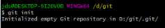
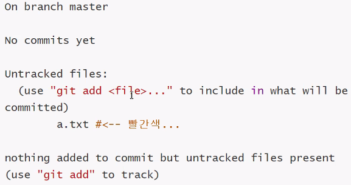
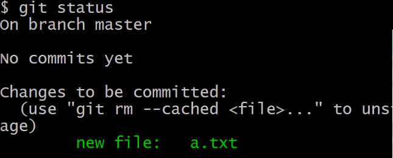
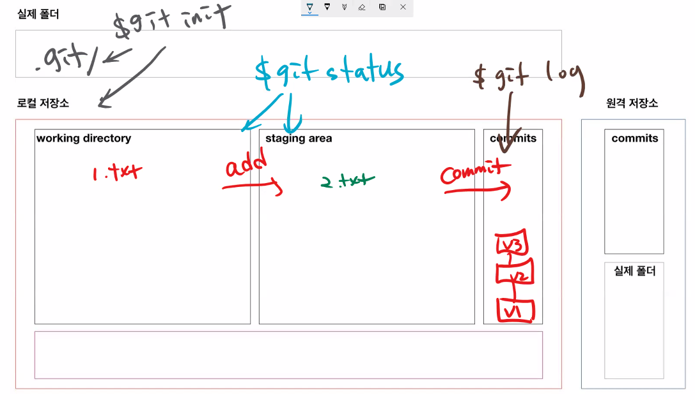

# Git-기초 문법

> ​	분산 버전 관리 시스템(DVCS)

## 준비 사항

* [git bash](https://gitforwindows.org/) ( 윈도우 사용하는 경우 필요 )

## 기본 문법

0.git 저장소 생성

```bash
$ git init
# 비어 있는 git 저장소(repository) 초기화 했다..
# test 폴더에(절대경로) .git 폴더에..
```



* 폴더에 저장소를 초기화 하면, 
  * `.git` 폴더가 생성되고
  * bash에는 `(master)` 라고 표기 된다.
* 주의사항!
  * git 저장소 내에 git 저장소를 만들지 말라.
    * `git init` 명령어 입력할때, `(master)`가 보이면 절대! 입력하지 말 것 

### 1.`add`

```bash
$ git add {디렉토리}
$ git add . # 현재 디렉토리(하위 디렉토리 포함)
$ git add a.txt # 특정 파일
$ git add myfolder/ # 특정 폴더
```

* `working diretory` 상태의 파일을 `staging area` 상태로 변경(첫번째통->두번째통)
* 커밋을 위한 파일들을 추가하는 명령어

#### 예시

```bash
$ touch a.txt # 파일을 만든다 ==> 코드 작업을 했다.
$ git status
# untracked files : 트래킹 x 파일들
# git add 명령어를 사용해라
# 커밋이 될 곳에 포함시키기 위해서 ...=> Staging area..
# nothing added to commit: 커밋할 것이 없음(SA X)
# untracked files present : (WD O)
```



```bash
$ git status
# 커밋될 변경사항들 : Staging area
# 새로운 파일! => 초록색
```



### 2.`commit`

```bash
$ git commit -m `{커밋메시지}`
```

* 커밋을 통해 하나의 버전을 기록 된다.
* 커밋 메시지는 현재 변경사항들을 잘 나타낼 수 있도록 작성하자
* 커밋은 고유한 아이디인 해시값을 가진다.
  * SHA-1 알고리즘에 의해 생성
* 커밋 목록은 `git log`명령어를 통해 확인할 수 있다.


### 3.`log`

```bash
$ git log
$ git log --oneleine
$ git log --2 # 두줄 보겠다
$ git log --oneline -1 # 1개를 한줄로
```

### 4.`status`

* working directory, staging area 공간의 파일 상태를 확인할 수 있다.





