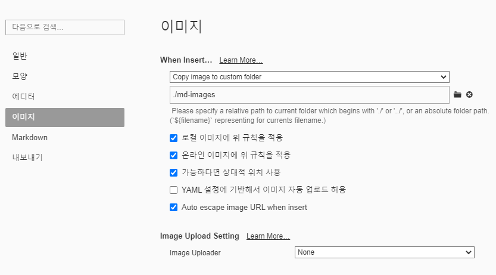
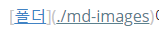
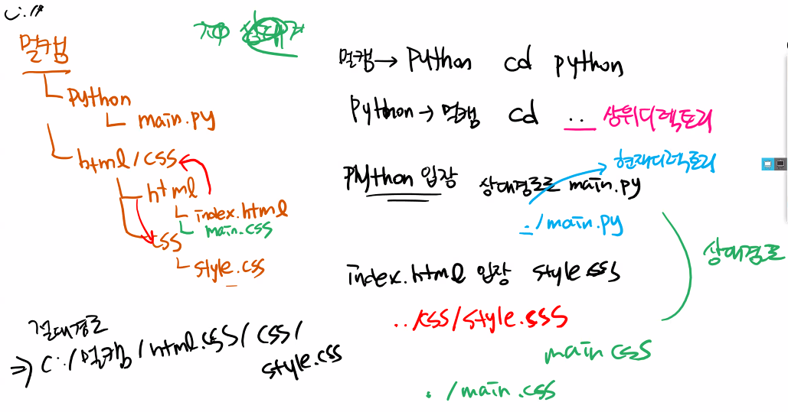

# 마크다운문법

## 제목(heading)

문서의 구조를 잡기 위해 활용된다. 제목의 레벨에 맞춰 `#` 으로 표현한다.

### 제목3

#### 제목4

##### 제목5

###### 제목6

## 목록

* 순서가 없는 목록
* 순서가 없습니다
  * tab해서 들어가시고
  * 엔터해서 계속 쓰시다가
* shift+tab 해서 나오시고
* 엔터

1. 순서가 있는 목록
2. 얘도 tab해보면
   1. 들어가지고
   2. 엔터해서 계속 쓰다가
3. shfit+tab 해서 나오시고

## 코드 블록

인라인 코드 블록 `def`  `*3 으로 코드블록 넣을수 있다 

```python
print('hello')
def foo():
    return true
```

```html
<!-- Test 주석 입니다. -->
<h1>
    Test 신기합니다.
</h1>
```

## 표

| 순서 | 이름 |      |
| ---- | ---- | ---- |
| 1    |      |      |
| 2    |      |      |
| 3    |      |      |




* Typora 설정을 통해 이미지를 상대 경로로 복사하여 관리 할수 있또록 아래와 같이 설정 한다.


## 링크

[구글링크](https://google.com) 눌러보기 

[폴더](./md-images)에 마크다운에 활용된 이미지가 있다. 


## 기타

*기울임(이탤릭체)*

**굵게(볼드체)**

~~취소선~~ <-- 물결 두개씩

---



